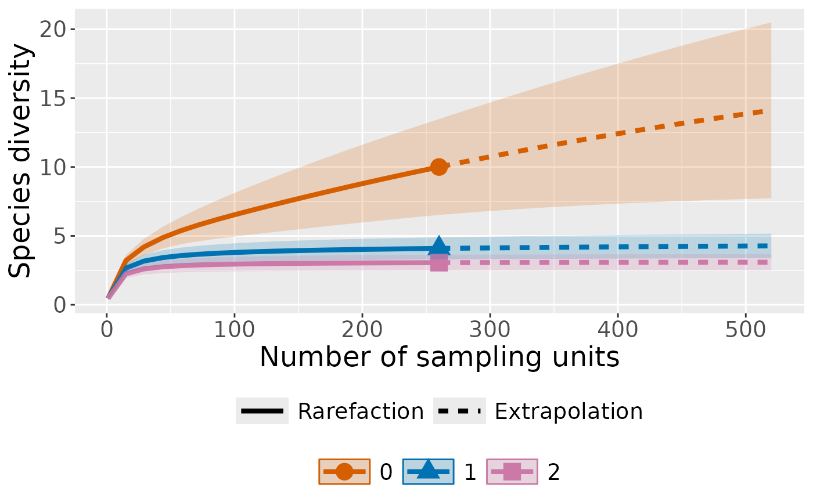
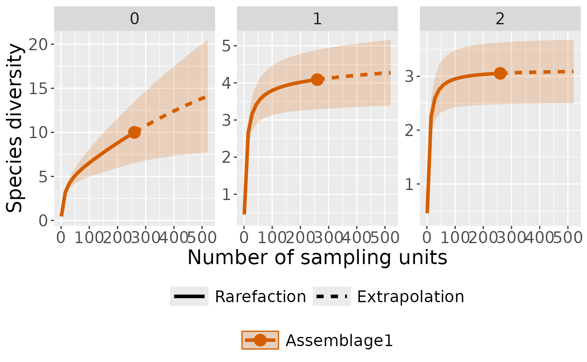
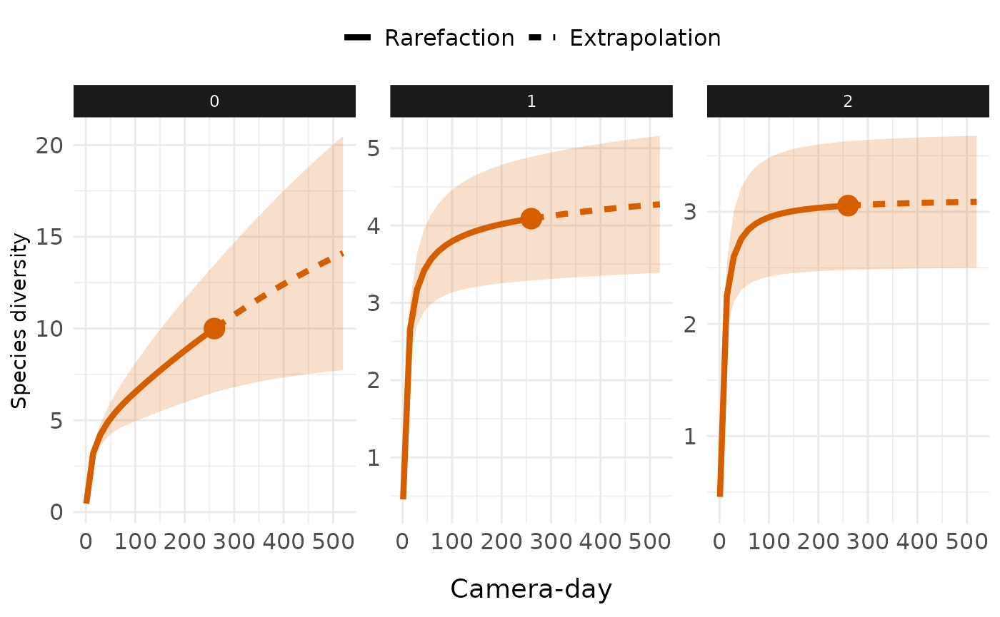

# Rarefaction and Extrapolation of Species Diversity Estimation with Camera Trap Data using ct R package

Species diversity estimation is a fundamental aspect of camera trap
ecology, but comparing diversity across sites with different sampling
efforts can be challenging. The `ct` package provides a solution by
implementing interpolation and extrapolation framework specifically
designed for camera trap data.

## Understanding Rarefaction and Extrapolation

**Rarefaction** downscales diversity estimates to a common, smaller
sample size, answering the question: *“How many species would we expect
if we had sampled less intensively?”* This technique helps compare
diversity between well-sampled and poorly-sampled sites on equal
footing.

**Extrapolation** projects diversity estimates beyond the observed
sample size, addressing: *“How many species would we detect with
additional sampling effort?”* This is particularly valuable for
estimating total community diversity and planning future sampling
efforts.

## Hill Numbers

The function estimates diversity using Hill numbers, which provide a
mathematically unified approach to measuring biodiversity:

- **q = 0 (Species Richness)**: Total number of species, giving equal
  weight to all species regardless of abundance
- **q = 1 (Shannon Diversity)**: Exponential of Shannon entropy,
  emphasizing common species
- **q = 2 (Simpson Diversity)**: Inverse of Simpson concentration,
  focusing on dominant species

This allows to understand how diversity patterns change when rare versus
common species are emphasized.

## Application with ct R package

We next describe the main function
[`ct_inext()`](https://stangandaho.github.io/ct/reference/ct_inext.md)
with its default arguments.

``` r

ct_inext(data, species_column, 
         site_column, size_column, 
         strata_column = NULL, diversity_order = 0, 
         sample_size = NULL, endpoint = NULL, 
         knots = 40, n_bootstrap = 100)
```

The arguments of this function are briefly described here and can be
further explored using illustrative examples. The function computes
incidence-frequency diversity estimates of order *q* (diversity_order =
*q*), along with sample coverage estimates and related statistics, for
*K* evenly spaced knots (if `knots = K`). Each knot corresponds to a
standardized number of sampling units for which diversity estimates are
calculated. By default, `endpoint` is set to twice the reference sample
size (i.e., twice the total number of sampling units). For example, if
`endpoint = 10` and `knots = 4`, diversity estimates will be computed
for a sequence of sample sizes `(1, 4, 7, 10)`. If `strata_column` is
provided, the function repeats this process separately for each stratum,
allowing comparisons among groups (e.g., habitats or treatments).
Bootstrap resampling is performed `n_bootstrap` times to obtain standard
errors and 95% confidence intervals for diversity and coverage
estimates.

## Workflow Example

Let’s walk through a complete analysis using camera trap data from the
`ct` package:

### Data Preparation

``` r

library(ct)
library(dplyr)

# Load prepare camera trap data
data(penessoulou)

camdata1 <- penessoulou %>% 
  dplyr::filter(project == "Last")%>% 
  dplyr::mutate(site = "pene") %>% 
  # Remove consecutive detections of the same species within 60 seconds
  ct_independence(species_column = species, 
                  site_column = camera,
                  datetime = datetimes,
                  threshold = 60, 
                  format = "%Y-%m-%d %H:%M:%S"
                  )

head(camdata1)
#> # A tibble: 6 × 13
#>   project image_name   camera   make     model species       number dates  times
#>   <chr>   <chr>        <chr>    <chr>    <chr> <chr>          <int> <chr>  <chr>
#> 1 Last    DSCF0017.JPG CAMERA 1 GardePro A3S   Canis adustus      1 3/24/… 22:0…
#> 2 Last    DSCF0045.JPG CAMERA 1 GardePro A3S   Canis adustus      1 3/27/… 0:30…
#> 3 Last    DSCF0057.JPG CAMERA 1 GardePro A3S   Canis adustus      1 3/27/… 0:33…
#> 4 Last    DSCF0061.JPG CAMERA 1 GardePro A3S   Canis adustus      1 3/27/… 1:21…
#> 5 Last    DSCF0065.JPG CAMERA 1 GardePro A3S   Canis adustus      1 3/27/… 1:27…
#> 6 Last    DSCF0081.JPG CAMERA 1 GardePro A3S   Canis adustus      1 3/27/… 22:2…
#> # ℹ 4 more variables: datetime <dttm>, longitude <int>, latitude <int>,
#> #   site <chr>
```

### Create Daily Sampling Units

Camera trap analysis typically requires converting detection records
into standardized sampling units. We use camera-days as our sampling
units:

``` r

# Aggregate data to daily detection records per camera
camday <- ct_camera_day(
  data = camdata1,
  deployment_column = camera,
  datetime_column = datetime,
  species_column = species,
  size_column = number
)
camday
#> # A tibble: 2,600 × 5
#>    camera   date       species                 number sampling_unit   
#>    <chr>    <date>     <chr>                    <int> <chr>           
#>  1 CAMERA 1 2024-03-24 Canis adustus                1 CAMERA 120240324
#>  2 CAMERA 1 2024-03-24 Chlorocebus aethiops         0 CAMERA 120240324
#>  3 CAMERA 1 2024-03-24 Erythrocebus patas           1 CAMERA 120240324
#>  4 CAMERA 1 2024-03-24 Genetta genetta              0 CAMERA 120240324
#>  5 CAMERA 1 2024-03-24 Lepus crawshayi              0 CAMERA 120240324
#>  6 CAMERA 1 2024-03-24 Mellivora capensis           0 CAMERA 120240324
#>  7 CAMERA 1 2024-03-24 Sylvicapra grimmia           0 CAMERA 120240324
#>  8 CAMERA 1 2024-03-24 Syncerus caffer              1 CAMERA 120240324
#>  9 CAMERA 1 2024-03-24 Thryonomys swinderianus      0 CAMERA 120240324
#> 10 CAMERA 1 2024-03-24 Tragelaphus scriptus         0 CAMERA 120240324
#> # ℹ 2,590 more rows
```

This creates a dataset where each row represents one day of sampling at
one camera location, with species detection counts for that day.

### Diversity Analysis

Now we can interpolate and extrapolate diversity trend across Hill
number orders:

``` r

# Run rarefaction and extrapolation analysis
int_ext <- ct_inext(data = camday, 
                    diversity_order = c(0, 1, 2),
                    species_column = species,
                    site_column = sampling_unit,
                    size_column = number,
                    knots = 40,
                    n_bootstrap = 50)
#> Warning in Fun(x, q, "Assemblage1"): Insufficient data to provide reliable
#> estimators and associated s.e.
```

There are several things to explain about the output of the function,
which is presented as follows:

    #> Compare 1 assemblages with Hill number order q = 0, 1, 2.
    #> $class: iNEXT
    #> 
    #> $DataInfo: basic data information
    #>   Assemblage   T   U S.obs    SC Q1 Q2 Q3 Q4 Q5 Q6 Q7 Q8 Q9 Q10
    #> 1     site.1 260 119    10 0.958  5  1  0  0  0  0  0  0  0   1
    #> 
    #> $iNextEst: diversity estimates with rarefied and extrapolated samples.
    #> $size_based (LCL and UCL are obtained for fixed size.)
    #> 
    #>      Assemblage   t        Method Order.q         qD    qD.LCL     qD.UCL
    #> 1   Assemblage1   1   Rarefaction       0  0.4576923 0.3855279  0.5298567
    #> 10  Assemblage1 130   Rarefaction       0  7.2497576 5.2696274  9.2298879
    #> 20  Assemblage1 260      Observed       0 10.0000000 6.5199444 13.4800556
    #> 30  Assemblage1 383 Extrapolation       0 12.1527849 7.2589429 17.0466269
    #> 40  Assemblage1 520 Extrapolation       0 14.1154484 7.7297582 20.5011385
    #> 41  Assemblage1   1   Rarefaction       1  0.4576923 0.3855279  0.5298567
    #> 50  Assemblage1 130   Rarefaction       1  3.8872824 3.1828793  4.5916855
    #> 60  Assemblage1 260      Observed       1  4.0886141 3.2885043  4.8887240
    #> 70  Assemblage1 383 Extrapolation       1  4.1920397 3.3434437  5.0406357
    #> 80  Assemblage1 520 Extrapolation       1  4.2740551 3.3880481  5.1600622
    #> 81  Assemblage1   1   Rarefaction       2  0.4576923 0.3855279  0.5298567
    #> 90  Assemblage1 130   Rarefaction       2  2.9897202 2.4437318  3.5357085
    #> 100 Assemblage1 260      Observed       2  3.0552319 2.4813815  3.6290823
    #> 110 Assemblage1 383 Extrapolation       2  3.0768843 2.4935752  3.6601935
    #> 120 Assemblage1 520 Extrapolation       2  3.0890764 2.5003862  3.6777666
    #>            SC    SC.LCL    SC.UCL
    #> 1   0.1465235 0.1106875 0.1823595
    #> 10  0.9494027 0.9177360 0.9810694
    #> 20  0.9580480 0.9264475 0.9896484
    #> 30  0.9653010 0.9355559 0.9950460
    #> 40  0.9719134 0.9455758 0.9982510
    #> 41  0.1465235 0.1106875 0.1823595
    #> 50  0.9494027 0.9177360 0.9810694
    #> 60  0.9580480 0.9264475 0.9896484
    #> 70  0.9653010 0.9355559 0.9950460
    #> 80  0.9719134 0.9455758 0.9982510
    #> 81  0.1465235 0.1106875 0.1823595
    #> 90  0.9494027 0.9177360 0.9810694
    #> 100 0.9580480 0.9264475 0.9896484
    #> 110 0.9653010 0.9355559 0.9950460
    #> 120 0.9719134 0.9455758 0.9982510
    #> 
    #> NOTE: The above output only shows five estimates for each assemblage; call iNEXT.object$iNextEst$size_based to view complete output.
    #> 
    #> $coverage_based (LCL and UCL are obtained for fixed coverage; interval length is wider due to varying size in bootstraps.)
    #> 
    #>      Assemblage        SC   t        Method Order.q         qD    qD.LCL
    #> 1   Assemblage1 0.1465261   1   Rarefaction       0  0.4577010 0.3838308
    #> 10  Assemblage1 0.9494027 130   Rarefaction       0  7.2497578 0.0000000
    #> 20  Assemblage1 0.9580480 260      Observed       0 10.0000000 1.3962742
    #> 30  Assemblage1 0.9653010 383 Extrapolation       0 12.1527849 2.4725003
    #> 40  Assemblage1 0.9719134 520 Extrapolation       0 14.1154484 3.4587261
    #> 41  Assemblage1 0.1465261   1   Rarefaction       1  0.4577005 0.3858037
    #> 50  Assemblage1 0.9494027 130   Rarefaction       1  3.8872824 2.8828462
    #> 60  Assemblage1 0.9580480 260      Observed       1  4.0886141 3.0836106
    #> 70  Assemblage1 0.9653010 383 Extrapolation       1  4.1920397 3.2050746
    #> 80  Assemblage1 0.9719134 520 Extrapolation       1  4.2740551 3.2917196
    #> 81  Assemblage1 0.1465261   1   Rarefaction       2  0.4576999 0.3883336
    #> 90  Assemblage1 0.9494027 130   Rarefaction       2  2.9897202 2.3978015
    #> 100 Assemblage1 0.9580480 260      Observed       2  3.0552319 2.4493834
    #> 110 Assemblage1 0.9653010 383 Extrapolation       2  3.0768843 2.4779360
    #> 120 Assemblage1 0.9719134 520 Extrapolation       2  3.0890764 2.4857005
    #>         qD.UCL
    #> 1    0.5315712
    #> 10  14.5068947
    #> 20  18.6037258
    #> 30  21.8330694
    #> 40  24.7721707
    #> 41   0.5295973
    #> 50   4.8917187
    #> 60   5.0936177
    #> 70   5.1790048
    #> 80   5.2563907
    #> 81   0.5270662
    #> 90   3.5816389
    #> 100  3.6610805
    #> 110  3.6758327
    #> 120  3.6924523
    #> 
    #> NOTE: The above output only shows five estimates for each assemblage; call iNEXT.object$iNextEst$coverage_based to view complete output.
    #> 
    #> $AsyEst: asymptotic diversity estimates along with related statistics.
    #>                    Observed Estimator  Est_s.e. 95% Lower 95% Upper
    #> Species Richness  10.000000 22.451923 8.5534475  5.687474 39.216372
    #> Shannon diversity  4.088614  4.463869 0.5389215  3.407602  5.520135
    #> Simpson diversity  3.055232  3.123680 0.2822613  2.570458  3.676902

## Understanding the Output

The
[`ct_inext()`](https://stangandaho.github.io/ct/reference/ct_inext.md)
function returns a iNEXT object with three main components: *DataInfo*,
*iNextEst*, and *AsyEst*

### i. DataInfo: Basic Community Information

This table provides essential community structure information:

- **T**: Total number of sampling units (2,182 camera-days)
- **U**: Total number of individuals detected (148 detections)
- **S.obs**: Observed species richness (10 species)
- **SC**: Sample coverage (97.3% - indicates sampling completeness)
- **Q1-Q10**: First ten incidence frequency counts (e.g., detection of
  the species in 4 camera trap)

The high sample coverage (97.3%) suggests our sampling captured most of
the species present in the community.

### ii. iNextEst: Diversity Curves

The `$iNextEst` element of the output consists of two data frames:
`$size_based` and `$coverage_based`. The `$size_based` data frame
provides results for each of the 40 interpolation and extrapolation
knots (sample sizes). For each knot, it reports the assemblage name, the
sample size (*m*), and the method used (Rarefaction, Observed, or
Extrapolation, depending on whether *m* is smaller than, equal to, or
larger than the reference sample size). It also includes the diversity
order (*order.q*), the estimated diversity (*qD*), its 95% confidence
interval (*qD.LCL* and *qD.UCL*), and the corresponding sample coverage
estimate (*SC*) along with its 95% confidence limits (*SC.LCL* and
*SC.UCL*). These coverage estimates and confidence intervals are used to
generate the sample completeness curve.

``` r

int_ext$iNextEst$size_based %>% 
  dplyr::slice_sample(prop = 0.15) # Sample 15% of rows
#>     Assemblage   t        Method Order.q         qD    qD.LCL     qD.UCL
#> 1  Assemblage1 115   Rarefaction       2  2.9730896 2.4339945  3.5121847
#> 2  Assemblage1 274 Extrapolation       1  4.1021361 3.2956020  4.9086703
#> 3  Assemblage1 356 Extrapolation       0 11.7145883 7.1280613 16.3011154
#> 4  Assemblage1   1   Rarefaction       2  0.4576923 0.3855279  0.5298567
#> 5  Assemblage1  58   Rarefaction       2  2.8386028 2.3526166  3.3245891
#> 6  Assemblage1 370 Extrapolation       0 11.9440798 7.1978250 16.6903347
#> 7  Assemblage1 438 Extrapolation       0 12.9908703 7.4825563 18.4991843
#> 8  Assemblage1  72   Rarefaction       2  2.8898855 2.3841974  3.3955736
#> 9  Assemblage1  29   Rarefaction       2  2.6012088 2.1978087  3.0046088
#> 10 Assemblage1 216   Rarefaction       1  4.0396000 3.2630342  4.8161659
#> 11 Assemblage1 520 Extrapolation       0 14.1154484 7.7297582 20.5011385
#> 12 Assemblage1   1   Rarefaction       0  0.4576923 0.3855279  0.5298567
#> 13 Assemblage1 274 Extrapolation       2  3.0586564 2.4833184  3.6339945
#> 14 Assemblage1 329 Extrapolation       2  3.0693374 2.4893393  3.6493355
#> 15 Assemblage1 342 Extrapolation       2  3.0713684 2.4904807  3.6522561
#> 16 Assemblage1  44   Rarefaction       0  4.8799061 4.0911842  5.6686281
#> 17 Assemblage1 301 Extrapolation       1  4.1268537 3.3086420  4.9450654
#> 18 Assemblage1 244   Rarefaction       0  9.6887437 6.3825683 12.9949190
#>           SC    SC.LCL    SC.UCL
#> 1  0.9480325 0.9152425 0.9808225
#> 2  0.9589446 0.9274475 0.9904418
#> 3  0.9638246 0.9335165 0.9941328
#> 4  0.1465235 0.1106875 0.1823595
#> 5  0.9297139 0.8892463 0.9701815
#> 6  0.9645978 0.9345739 0.9946218
#> 7  0.9681246 0.9396764 0.9965727
#> 8  0.9382836 0.9002105 0.9763567
#> 9  0.8826113 0.8364191 0.9288036
#> 10 0.9551929 0.9257415 0.9846442
#> 11 0.9719134 0.9455758 0.9982510
#> 12 0.1465235 0.1106875 0.1823595
#> 13 0.9589446 0.9274475 0.9904418
#> 14 0.9622855 0.9314863 0.9930847
#> 15 0.9630346 0.9324615 0.9936076
#> 16 0.9145171 0.8715972 0.9574371
#> 17 0.9606201 0.9294090 0.9918313
#> 18 0.9570098 0.9271957 0.9868240
```

The `$coverage_based` data frame provides results standardized by sample
coverage rather than sample size. For each coverage level, it reports
the assemblage name, the standardized sample coverage (*SC*), and the
corresponding sample size (*m*) required to achieve that coverage (based
on the 40 rarefaction and extrapolation knots). It also specifies the
method (Rarefaction, Observed, or Extrapolation, depending on whether
*SC* is lower than, equal to, or higher than the reference sample
coverage), the diversity order (*order.q*), the diversity estimate
(*qD*), and its 95% confidence interval (*qD.LCL* and *qD.UCL*). These
coverage-based diversity estimates and confidence intervals are used to
construct the coverage-based rarefaction/extrapolation (R/E) curves.

``` r

int_ext$iNextEst$coverage_based %>% 
  dplyr::slice_sample(prop = 0.15) # Sample 15% of rows
#>     Assemblage        SC   t        Method Order.q        qD    qD.LCL
#> 1  Assemblage1 0.9551929 216   Rarefaction       2  3.041655 2.4361631
#> 2  Assemblage1 0.8826114  29   Rarefaction       1  3.168595 2.4624766
#> 3  Assemblage1 0.9523985 173   Rarefaction       2  3.021932 2.4158888
#> 4  Assemblage1 0.9551929 216   Rarefaction       0  9.125750 0.8550295
#> 5  Assemblage1 0.9589446 274 Extrapolation       1  4.102136 3.0977334
#> 6  Assemblage1 0.9719134 520 Extrapolation       0 14.115448 3.4587261
#> 7  Assemblage1 0.9622855 329 Extrapolation       2  3.069337 2.4666276
#> 8  Assemblage1 0.9514096 158   Rarefaction       0  7.885387 0.2687914
#> 9  Assemblage1 0.9542194 201   Rarefaction       2  3.035706 2.4296699
#> 10 Assemblage1 0.9494027 130   Rarefaction       2  2.989720 2.3978015
#> 11 Assemblage1 0.9480325 115   Rarefaction       1  3.845925 2.8453109
#> 12 Assemblage1 0.9638246 356 Extrapolation       2  3.073392 2.4742850
#> 13 Assemblage1 0.9681246 438 Extrapolation       1  4.228537 3.2450702
#> 14 Assemblage1 0.9622855 329 Extrapolation       0 11.257748 1.9902402
#> 15 Assemblage1 0.9494027 130   Rarefaction       0  7.249758 0.0000000
#> 16 Assemblage1 0.9480325 115   Rarefaction       2  2.973090 2.3834818
#> 17 Assemblage1 0.9561014 230   Rarefaction       0  9.410157 1.0235024
#> 18 Assemblage1 0.9598221 288 Extrapolation       1  4.115171 3.1120128
#>       qD.UCL
#> 1   3.647147
#> 2   3.874713
#> 3   3.627975
#> 4  17.396470
#> 5   5.106539
#> 6  24.772171
#> 7   3.672047
#> 8  15.501983
#> 9   3.641743
#> 10  3.581639
#> 11  4.846540
#> 12  3.672500
#> 13  5.212004
#> 14 20.525256
#> 15 14.506895
#> 16  3.562697
#> 17 17.796812
#> 18  5.118329
```

Note that in this example, we do not have a specific assemblage or site.
Here, “Assemblage” refers to the different strata levels (for example,
habitat types such as “Savanna,” “Forest,” etc.) where the sampling took
place. If nothing is provided (i.e., `strata_column = NULL`) in the
[`ct_inext()`](https://stangandaho.github.io/ct/reference/ct_inext.md)
function, the “Assemblage” column will simply contain the same value —
“Assemblage1” for all coverage levels.

### iii. AsyEst: Asymptotic Estimates

The \$AsyEst element summarizes the asymptotic diversity estimates for
each assemblage. It reports the assemblage name, the type of diversity
(species richness for q = 0, Shannon diversity for q = 1, and Simpson
diversity for q = 2), the observed diversity, the estimated asymptotic
diversity value, its standard error, and the associated 95% confidence
interval (lower and upper limits). These asymptotic estimates are
calculated using appropriate functions for each diversity order,
providing an estimate of the expected diversity if sampling were
exhaustive.

## Visualization with ct_plot_inext()

The
[`ct_plot_inext()`](https://stangandaho.github.io/ct/reference/ct_plot_inext.md)
transforms rarefaction and extrapolation results into customizable
visualizations, enabling intuitive interpretation. It supports three
main plot types: **type = 1** (sample-size-based curves) showing how
diversity accumulates with increased sampling effort, **type = 2**
(sample completeness curves) illustrating the relationship between
sample size and coverage to assess sampling adequacy, and **type = 3**
(coverage-based curves) standardizing diversity comparisons by
completeness for more ecologically meaningful contrasts. Users can
customize plots with `facet_var` to split panels by assemblage,
diversity order, or both, and with `color_var` to color-code curves by
assemblage, diversity order, both, or not at all—offering flexible
options for comparing sites, treatments, or diversity measures visually.

### Plot with curves colored by order

``` r

ct_plot_inext(int_ext, type = 1, color_var = "Order.q")
#> Warning: `aes_string()` was deprecated in ggplot2 3.0.0.
#> ℹ Please use tidy evaluation idioms with `aes()`.
#> ℹ See also `vignette("ggplot2-in-packages")` for more information.
#> ℹ The deprecated feature was likely used in the iNEXT package.
#>   Please report the issue at <https://github.com/AnneChao/iNEXT/issues>.
#> This warning is displayed once per session.
#> Call `lifecycle::last_lifecycle_warnings()` to see where this warning was
#> generated.
```



### Plot with curves faceted by order

``` r

ct_plot_inext(int_ext, type = 1, facet_var = "Order.q")
#> Warning in ggiNEXT.iNEXT(x = inext_object, type = type, se = se, facet.var =
#> facet_var, : invalid color.var setting, the iNEXT object do not consist
#> multiple assemblages, change setting as Order.q
```



### Customize with ggplot2

``` r

library(ggplot2)
ct_plot_inext(int_ext, type = 1, facet_var = "Order.q")+
  # Remove assemblage legend
  guides(color = "none", shape = "none", fill = "none")+
  # Change axis title x
  labs(x = "Camera-day")+
  theme_minimal()+
  theme(
    # Change strip style
    strip.background = element_rect(fill = "gray10", color = NA),
    strip.text = element_text(colour = "white"),
    # Move axis tile x to bottom and increase text size
    axis.title.x = element_text(margin = margin(t = 1, unit = "lines"),
                                size = 14),
    # Increase axis text (both x and y) size
    axis.text = element_text(size = 12),
    # Move legend to top
    legend.position = "top",
    # Increase legend label size
    legend.text = element_text(size = 12)
  )
#> Warning in ggiNEXT.iNEXT(x = inext_object, type = type, se = se, facet.var =
#> facet_var, : invalid color.var setting, the iNEXT object do not consist
#> multiple assemblages, change setting as Order.q
```


