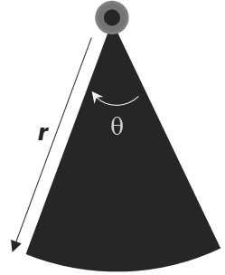
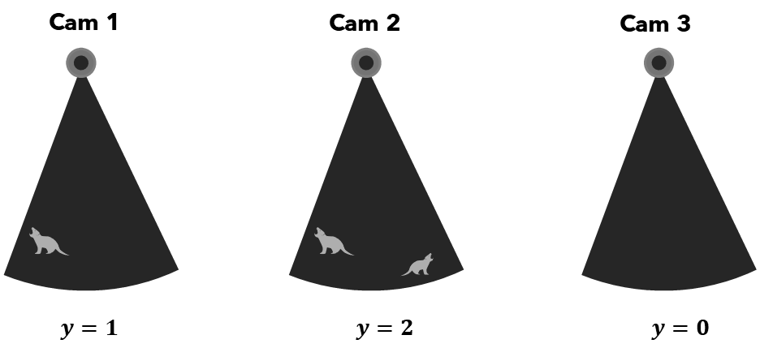
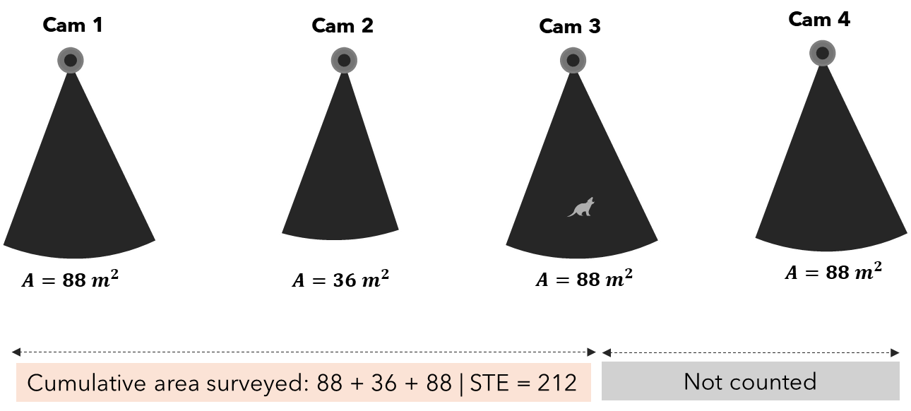
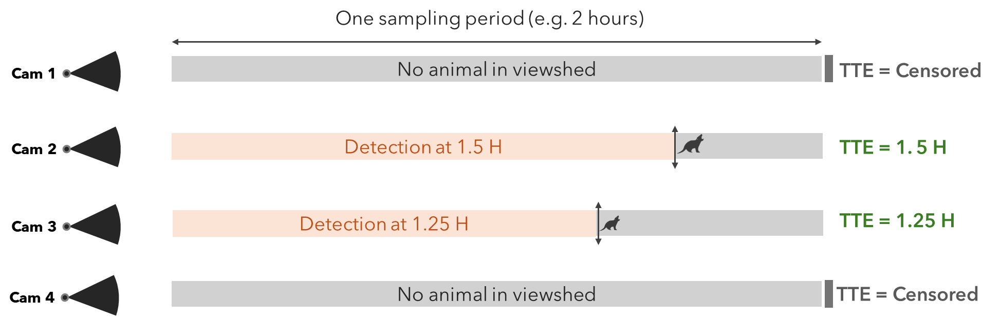

# Estimating Wildlife Abundance from Camera Traps With SpaceNTime Methods

------------------------------------------------------------------------

## Why this matters

Every wildlife manager, ecologist, and conservation biologist eventually
faces the same stubborn question: *how many animals are out there?*
Classic approaches (mark-recapture, distance sampling, N-mixture models)
carry real-world prerequisites that can be difficult or impossible to
meet. Many require that individual animals be reliably identified across
encounters, which rules out species where individuals look alike, or
study areas too vast for comprehensive marking efforts.

Camera traps changed the game. Deploy enough of them across a landscape
and you amass an archive of animal detections. But raw detection counts
are not abundance estimates. They are a tangled function of animal
density, movement, behaviour, and camera placement. Turning counts into
density requires a model.

**SpaceNTime** is a family of three such models introduced by [Moeller,
Lukacs, and Horne (2018)](https://doi.org/10.1002/ecs2.2331). Their key
insight: by framing camera-trap detections as spatial or temporal random
processes, animal density can be estimated from nothing more than camera
identifiers, image timestamps, and per-detection animal counts.

This tutorial walks through the theory behind the three SpaceNTime
estimators — **Space-To-Event (STE)**, **Time-To-Event (TTE)**, and
**Instantaneous Sampling Estimator (ISE)** — and shows how to apply all
three using the `ct` package in a clean, fully automated workflow.

------------------------------------------------------------------------

## The theory of SpaceNTime

### Cameras as random samplers

Imagine scattering cameras randomly across a forest. Each camera watches
a small patch called *viewshed*; area \\A_i\\ (in m², ha, or whatever
unit your study uses). The viewshed of each camera is approximated as a
circular sector of radius \\r\\ (the maximum detection distance, in
metres) and angle \\\theta\\ (the horizontal field of view, in degrees):

\\A = \frac{\pi r^2 \theta}{360}\\

where \\A\\ is the viewshed area in m², \\r\\ is the detection radius,
and \\\theta\\ is the camera’s field-of-view angle.



Figure 1: Schematic representation of a camera trap detection zone,
showing the radial detection distance (r) and detection angle (θ) that
define the camera’s viewshed area (also called field of view)

The value of \\r\\ and \\\theta\\ are generally specified by the camera
manufacturer. At any given moment, an animal is either inside that
viewshed or it is not. Over time, animals wander in and out as they move
through the landscape.

The SpaceNTime framework treats each camera’s viewshed as an independent
sampler of the landscape, and exploits the *geometry* and *timing* of
animal encounters to infer density. The three estimators do this
differently.

### 1. Instantaneous Sampling Estimator (ISE)

The ISE is the most conceptually straightforward of the three. At a set
of predetermined moments in time — think of them as camera “snapshots” —
the observer asks: *is an animal inside this viewshed right now?* Each
snapshot yields a count \\y\_{ij}\\ for camera \\i\\ at occasion \\j\\.

The estimator recognises that:

\\\hat{D} = \frac{1}{MK} \sum\_{i=1}^{M} \sum\_{j=1}^{K}
\frac{y\_{ij}}{A\_{ij}}\\

where \\M\\ is the number of cameras, \\K\\ is the number of sampling
occasions, and \\A\_{ij}\\ is the viewshed area of camera \\i\\ at
occasion \\j\\. This is essentially a ratio estimator of density:
animals per unit area. Multiplied by the total study area, it gives
\\\hat{N}\\.



Figure 2: Instantaneous Sampling (ISE). At a fixed snapshot moment, each
camera reports a count of animals in its viewshed. Cameras with larger
viewsheds contribute more area to the denominator. The density estimate
is the mean count-per-unit-area across all cameras and occasions.

The ISE is analogous to a point count in avian surveys. Its limitation
is that it only counts animals *inside* the viewshed at the exact
sampling moment, so it needs enough occasions and cameras to produce a
reliable mean.

### 2. Space-To-Event (STE)

The STE estimator is inspired by distance sampling, but turns the
spatial axis sideways. Instead of asking “how far away was the animal?”,
it asks: “how much camera viewshed area did we have to survey before we
detected the first animal?”

On each sampling occasion, cameras are conceptually ordered in a random
sequence. We accumulate viewshed area until the first animal is
detected. The cumulative area at that first detection, i.e
*space-to-event* is the key statistic. If animals are rare, we expect to
accumulate a lot of area before seeing one. If animals are dense, the
first encounter comes quickly.

Formally, the STE values are modelled as an exponential distribution
with rate parameter \\\lambda\\ (density), which is estimated via
[maximum
likelihood](https://medium.com/data-science/probability-concepts-explained-maximum-likelihood-estimation-c7b4342fdbb1).
The result is a density estimate that explicitly accounts for how much
habitat was surveyed.



Figure 3: Space-To-Event (STE). Cameras are placed in a random order.
Viewshed areas are accumulated until the first animal is detected. The
total accumulated area at that point is the Space-To-Event value (here
212 m² here) and representes the key statistic. Cameras after the first
detection (crossed out) contribute nothing to the current occasion.
Across many occasions, STE values are modelled as an exponential
distribution to estimate density.

STE values across all occasions are modelled as Exp(λ), where λ =
density (animals per m²). High density → small STE values and Low
density → large STE values. λ is estimated by maximum likelihood.
Abundance: N̂ = λ̂ × study area. The STE estimator is particularly
valuable when animal activity within a sampling period is sparse — a
single detection per occasion is all it needs.

### 3. Time-To-Event (TTE)

The TTE estimator applies the same exponential-distribution logic to the
*temporal* axis. Instead of measuring area-to-first-detection, it
measures *time-to-first-detection* within each sampling period.

Each camera is activated for a short sampling period. The clock starts.
The question is: how long does it take for the first animal to enter the
viewshed? If animals are dense and moving, the wait is short. If animals
are sparse, the wait is long.



Figure 4: The clock starts when the sampling period opens. Camera 2
detects an animal at 1.5 hours and Camera 2 at 1.25 hours — that’s the
TTE. Camera 1 et 4 detect nothing; the TTE is censored at the end of the
period and contributes to the likelihood differently. Both observed and
censored times are used in the exponential Maximum Likelihood Estimate.

A censored observation corresponds to a camera-trap site where the
target species was not detected before the end of the sampling period.
It does not mean zero detection. The true detection time is longer than
the observed time, but we do not know exactly how much longer. These
cameras were treated as right-censored observations.

The TTE requires knowledge of viewshed transit time (\\\tau\\), the mean
time for an animal to cross the camera viewshed. It is essentially a
function of viewshed size and typical animal movement speed. Given
\\\tau\\, the rate of encounter can be linked directly to animal
density. For an animal with a movement speed of 30 m/hr passing through
camera viewsheds of 300 m², 400 m², and 380 m², the \\\tau\\ or
(sampling period can be approximated as):

\\{\tau} = {\frac{\sqrt{\frac{1}{n}\sum\_{i=1}^{n} A_i}}{30/3600}}\\

where represents the camera viewshed areas (in m²) and is the number of
cameras. The denominator is the animal speed converted from meters/hour
to meters/second. TTE values ≤ \\\tau\\ are scaled by area.

Like STE, TTE values are modelled with an exponential distribution and
estimated via maximum likelihood. It is well-suited to studies where
animal movement is relatively well characterised and multiple
independent sampling periods can be conducted.

### A note on assumptions

All three estimators share some important assumptions:

- **Random camera placement** (or at minimum, placement that is not
  correlated with animal density)
- **Animals move independently** of one another and at random relative
  to camera positions
- **Closed population** within the sampling window (no births, deaths,
  or large-scale immigration/emigration)
- **No attraction to or avoidance of cameras**

Violations of these assumptions can bias estimates, just as they would
in any wildlife sampling framework. The SpaceNTime methods, however, are
notably robust to heterogeneity in detection probability.

## The `ct` package

The original `spaceNtime` R package (Moeller & Lukacs 2021) implemented
these estimators as a series of lower-level building blocks: helper
functions to build sampling occasions, construct encounter histories,
and then pass the results to estimation functions. While powerful, this
design placed a heavy burden on the user: each step had to be called
explicitly, outputs had to be connected manually.

The `ct` package wraps the full SpaceNTime pipeline into three
high-level, production-quality functions:

| Function | Method | Description |
|----|----|----|
| [`ct_fit_ste()`](https://stangandaho.github.io/ct/reference/ct_fit_ste.md) | Space-To-Event | Area-to-first-detection estimator |
| [`ct_fit_tte()`](https://stangandaho.github.io/ct/reference/ct_fit_tte.md) | Time-To-Event | Time-to-first-detection estimator |
| [`ct_fit_ise()`](https://stangandaho.github.io/ct/reference/ct_fit_ise.md) | Instantaneous Sampling | Point-in-time snapshot estimator |

### What’s improved

Every `ct_fit_*()` function builds its own occasions and encounter
history internally, in a single call. Before any computation begins,
your data and deployment tables are rigorously validated: column types,
timezone consistency, camera-deployment alignment, temporal coverage,
and more. If something is wrong, you get an error that tells you exactly
what to fix. Each function emits structured progress messages, so you
can follow where the computation is as it runs. Function arguments are
named for readability.

## A worked example

### Data preparation

The example below uses camera-trap data from [Gandaho et
al. (2026)](https://doi.org/10.5281/zenodo.19662320), a study on habitat
loss and species diel ecology in a West African community wetland
reserve. The raw export is a CSV where each row is one image, with EXIF
metadata (camera model, date, time) and observer-recorded fields
(species, count, station).

The preparation script below reads that CSV and produces the two tables
the `ct_fit_*()` functions expect:

- **`data`** — one row per detection event, with columns `cam`,
  `datetime`, and `count`.
- **`deployment_data`** — one row per camera deployment period, with
  columns `cam`, `start`, `end`, and `area`.

> **Using your own data.** You do not need to follow this exact
> workflow. Any processing pipeline is fine as long as the two output
> tables contain those required columns with the correct types (`cam`
> can be any consistent type; `datetime`, `start`, and `end` must be
> `POSIXct` with a matching timezone; `count` and `area` must be
> numeric).

``` r

library(dplyr)
library(ct)

# 1. Detection data
# Source: Gandaho et al. (2026), https://doi.org/10.5281/zenodo.19662320
# Adjust the file path to where you saved the CSV.
camdata <- read.csv("path/to/agonve_camtrap_data.csv") %>%
  mutate(model = ifelse(grepl("trail camera", tolower(Make)), "RD1003L", "TC302445")) %>%
  select(image = Image, deployment = deployment, cam = Station, model, 
         dates = Date, times = Time, species = Species,count = Count
  ) %>%
  # The EXIF datetime format is like "2026:01:31 12:01:26"
  mutate(
    datetime = as.POSIXct(paste(dates, times), format = "%Y:%m:%d %H:%M:%OS")
  ) %>%
  as_tibble()

head(camdata, 10)
```

| image | deployment | cam | model | dates | times | species | count | datetime |
|:---|:---|:---|:---|:---|:---|:---|---:|:---|
| IMAG0012.jpg | Deployment 2 | cam03_2 | RD1003L | 2025:03:28 | 1:57:56 | Genetta sp. | 1 | 2025-03-28 01:57:56 |
| IMAG0013.jpg | Deployment 2 | cam03_2 | RD1003L | 2025:03:28 | 1:57:58 | Genetta sp. | 1 | 2025-03-28 01:57:58 |
| IMAG0014.jpg | Deployment 2 | cam03_2 | RD1003L | 2025:03:28 | 1:57:59 | Genetta sp. | 1 | 2025-03-28 01:57:59 |
| IMAG0020.jpg | Deployment 2 | cam03_2 | RD1003L | 2025:04:09 | 22:46:36 | Genetta sp. | 1 | 2025-04-09 22:46:36 |
| IMAG0021.jpg | Deployment 2 | cam03_2 | RD1003L | 2025:04:09 | 22:46:37 | Genetta sp. | 1 | 2025-04-09 22:46:37 |
| IMAG0022.jpg | Deployment 2 | cam03_2 | RD1003L | 2025:04:09 | 22:46:38 | Genetta sp. | 1 | 2025-04-09 22:46:38 |
| IMAG0027.jpg | Deployment 3 | cam10_3 | TC302445 | 2025:05:17 | 5:26:26 | Tragelaphus spekii | 1 | 2025-05-17 05:26:26 |
| IMAG0135.jpg | Deployment 3 | cam10_3 | TC302445 | 2025:06:03 | 0:38:45 | Tragelaphus spekii | 1 | 2025-06-03 00:38:45 |
| IMAG0023.jpg | Deployment 3 | cam11_3 | TC302445 | 2025:05:26 | 4:34:43 | Genetta sp. | 1 | 2025-05-26 04:34:43 |
| IMAG0027.jpg | Deployment 3 | cam11_3 | TC302445 | 2025:05:29 | 2:43:45 | Genetta sp. | 1 | 2025-05-29 02:43:45 |

``` r


# 2. Deployment data
# No separate deployment sheet is available, so we derive start/end from the
# first and last detection per deployment — a reasonable proxy for camera-on
# and pull-up times.
deployment_data <- camdata %>%
  group_by(deployment, cam, model) %>%
  reframe(model = unique(model), start = min(datetime), end   = max(datetime)
  ) %>%
  ungroup() %>%
  # Camera detection geometry from the manufacturer spec sheet
  mutate(
    radius = case_when(model == "RD1003L" ~ 60, TRUE ~ 65),  # detection range (ft)
    radius = ct_convert_unit(radius, "ft", "m"),             # convert to metres
    angle = case_when(model == "RD1003L" ~ 60, TRUE ~ 120),  # horizontal FOV (°)
    area = (angle / 360) * (pi * radius^2)                   # viewshed area (m²)
  )
```

| deployment | cam | model | start | end | radius | angle | area |
|:---|:---|:---|:---|:---|---:|---:|---:|
| Deployment 1 | cam03_1 | RD1003L | 2025-04-28 17:38:59 | 2025-04-28 17:39:02 | 18.288 | 60 | 175.1181 |
| Deployment 1 | cam06_1 | RD1003L | 2025-03-30 08:53:55 | 2025-03-30 08:54:31 | 18.288 | 60 | 175.1181 |
| Deployment 2 | cam03_2 | RD1003L | 2025-03-28 00:57:56 | 2025-04-09 21:46:38 | 18.288 | 60 | 175.1181 |
| Deployment 3 | cam02_3 | TC302445 | 2025-05-11 21:13:09 | 2025-05-15 23:18:10 | 19.812 | 120 | 411.0411 |
| Deployment 3 | cam03_3 | RD1003L | 2025-06-03 17:36:27 | 2025-06-03 17:36:30 | 18.288 | 60 | 175.1181 |
| Deployment 3 | cam03_3 | TC302445 | 2025-05-13 11:50:26 | 2025-05-16 18:47:54 | 19.812 | 120 | 411.0411 |
| Deployment 3 | cam06_3 | TC302445 | 2025-05-13 10:58:35 | 2025-06-09 10:39:45 | 19.812 | 120 | 411.0411 |
| Deployment 3 | cam10_3 | TC302445 | 2025-05-17 04:26:26 | 2025-06-02 23:38:45 | 19.812 | 120 | 411.0411 |
| Deployment 3 | cam11_3 | TC302445 | 2025-05-13 10:51:07 | 2025-06-07 22:12:50 | 19.812 | 120 | 411.0411 |
| Deployment 3 | cam12_3 | TC302445 | 2025-05-13 09:23:24 | 2025-06-07 14:52:46 | 19.812 | 120 | 411.0411 |

### The viewshed transit time for TTE

The TTE estimator needs one additional scalar: `viewshed_transit_time`.
A practical approximation for mona monkey:

``` r

# Animal movement speed: 22 m/hr → m/s
movement_speed <- 300 / 3600

# Select only camera with mona detection
camdata <- camdata %>% 
  dplyr::filter(species == "Cercopithecus mona")

deployment_data <- deployment_data %>% 
  dplyr::filter(cam %in% unique(camdata$cam))

# Viewshed transit time (seconds)
tau <- sqrt(mean(deployment_data$area)) / movement_speed
```

The viewshed transit time for mona monkey is 234.9

### Fitting the models

The total study area for this reserve is approximately 32 km m².
Occasions are built at hourly intervals (`sampling_frequency = 3600`)
with a 10-second attribution window (`sampling_length = 10`).

#### Space-To-Event

``` r

ste_result <- ct_fit_ste(
  data = camdata,
  deployment_data = deployment_data,
  sampling_frequency = 3600,
  sampling_length = 30*60,
  study_area = ct_convert_unit(32, "km^2", "m^2"), # total study area (m²)
  quiet = TRUE
)

ste_result
#> # A tibble: 1 × 4
#>       N    SE   LCI   UCI
#>   <dbl> <dbl> <dbl> <dbl>
#> 1  475.  51.9  384.  588.
```

#### Time-To-Event

``` r

tte_result <- ct_fit_tte(
  data = camdata,
  deployment_data = deployment_data,
  viewshed_transit_time = tau, 
  periods_per_occasion = 60, # 24 periods per occasion
  time_between_occasions = 3600, # 1-hour gap between occasions (seconds)
  study_area = ct_convert_unit(32, "km^2", "m^2"),
  quiet = TRUE
)

tte_result
#> # A tibble: 1 × 4
#>       N    SE   LCI   UCI
#>   <dbl> <dbl> <dbl> <dbl>
#> 1  502.  44.4  422.  597.
```

#### Instantaneous Sampling

``` r

ise_result <- ct_fit_ise(
  data = camdata,
  deployment_data = deployment_data,
  sampling_frequency = 3600, # one snapshot per hour (seconds)
  sampling_length = 30*60, # 100-second snapshot window (seconds)
  study_area = ct_convert_unit(32, "km^2", "m^2"),
  quiet = TRUE
)

ise_result
#> # A tibble: 1 × 4
#>       N    SE   LCI   UCI
#>   <dbl> <dbl> <dbl> <dbl>
#> 1  480.  159.  255.  905.
```

## References

Gandaho, S. M., Agossou, H., Madokoun, D. L., Hounnouvi, E. F. K.,
Oussoukpevi, S. J. K., Akpona, H. A., Thompson, L., & Djagoun, C. A. M.
S. (2026). Habitat loss and species diel ecology in a West African
community wetland reserve \[Data set\]. Zenodo.
<https://doi.org/10.5281/zenodo.19662320>

Moeller, A. K., Lukacs, P. M., and Horne, J. S. (2018). Three novel
methods to estimate abundance of unmarked animals using remote cameras.
*Ecosphere*, 9(8), e02331. <https://doi.org/10.1002/ecs2.2331>

Moeller, A. K. and Lukacs, P. M. (2021). spaceNtime: an R package for
estimating abundance of unmarked animals using camera-trap photographs.
*Mammalian Biology*. <https://doi.org/10.1007/s42991-021-00181-8>
