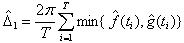
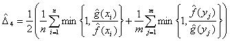
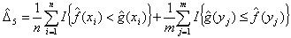

# Estimates of coefficient of overlapping

Estimates of coefficient of overlapping

## Usage

``` r
ct_overlap_estimates(
  A,
  B,
  kmax = 3,
  adjust = c(0.8, 1, 4),
  n_grid = 128,
  type = c("all", "Dhat1", "Dhat4", "Dhat5")
)
```

## Arguments

- A:

  A numeric vector of time-of-day observations (in radians, 0 to
  \\2\pi\\) for species A.

- B:

  A numeric vector of time-of-day observations (in radians, 0 to
  \\2\pi\\) for species B.

- kmax:

  An integer indicating the maximum number of modes allowed in the
  activity pattern. Default is 3.

- adjust:

  A numeric value to adjust the bandwidth of the kernel density
  estimation. Default is 1.

- n_grid:

  An integer specifying the number of grid points for density
  estimation. Default is 128.

- type:

  the name of the estimator to use: Dhat4 is recommended if both samples
  are larger than 50, otherwise use Dhat1. See Details. The default is
  "all" for compatibility with older versions.

## Details

See [`overlapTrue`](https://rdrr.io/pkg/overlap/man/overlapTrue.html)
for the meaning of coefficient of overlapping, \\\Delta\\.

These estimators of \\\Delta\\ use kernel density estimates fitted to
the data to approximate the true density functions *f(t)* and *g(t)*.
Schmid & Schmidt (2006) propose five estimators of overlap:

Dhat1 is calculated from vectors of densities estimated at *T*
equally-spaced times, *t*, between 0 and \\2\pi\\:



For circular distributions, Dhat2 is equivalent to Dhat1, and Dhat3 is
inapplicable.

Dhat4 and Dhat5 use vectors of densities estimated at the times of the
observations of the species, *x* and *y*:

  
  


where *n, m* are the sample sizes and *I* is the indicator function (1
if the condition is true, 0 otherwise).

Dhat5 simply checks which curve is higher at each point; even tiny
changes in the data can result in large, discontinuous changes in Dhat5,
and it can take values \> 1. Don't use Dhat5.

Comparing curves at times of actual observations works well if there are
enough observations of each species. Simulations show that Dhat4 is best
when the smallest sample has at least 50 observations. Dhat1 compares
curves at `n.grid` equally spaced points, and is best for small samples.

## Examples

``` r
set.seed(42)
species_A <- runif(100, 1.2, 2 * pi)
species_B <- runif(100, 0.23, 2 * pi)
ct_overlap_estimates(species_A, species_B)
#>     Dhat1     Dhat4     Dhat5 
#> 0.8579292 0.8573376 0.8400000 
ct_overlap_estimates(species_A, species_B, type = "Dhat4")
#>     Dhat4 
#> 0.8573376 
```
