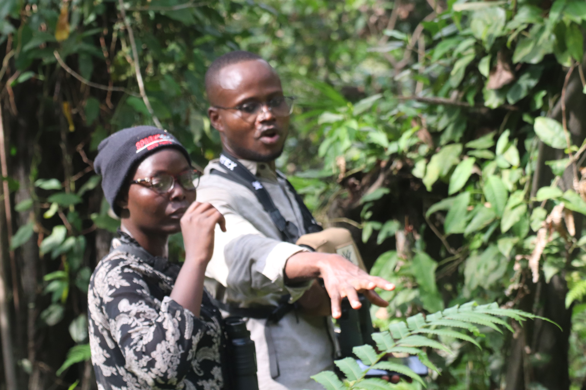
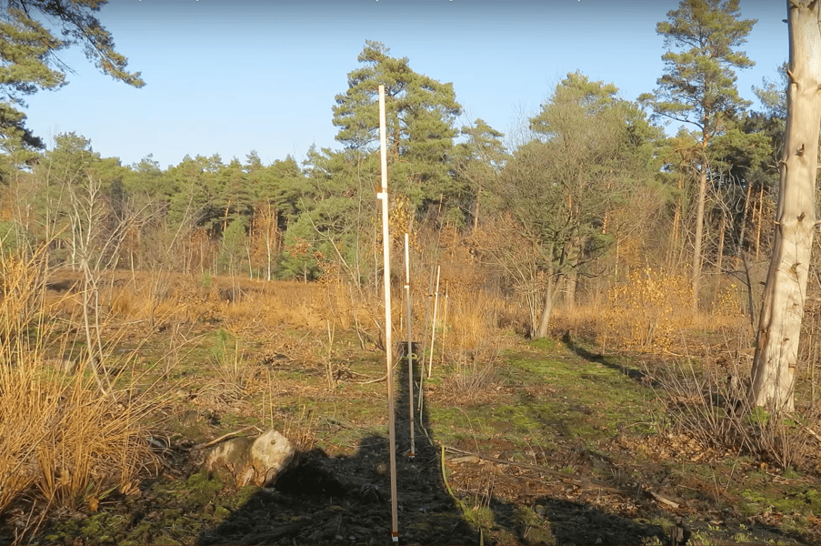
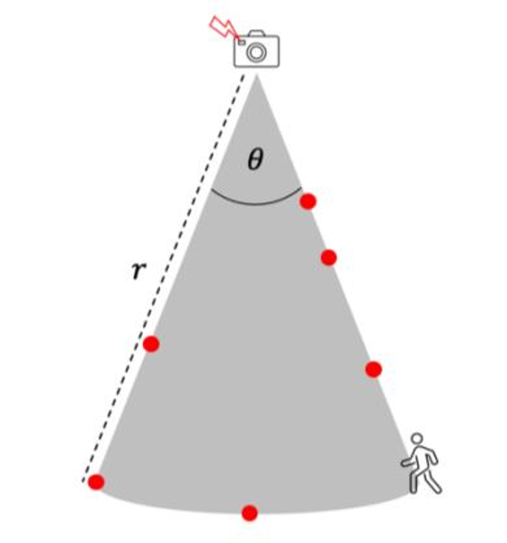
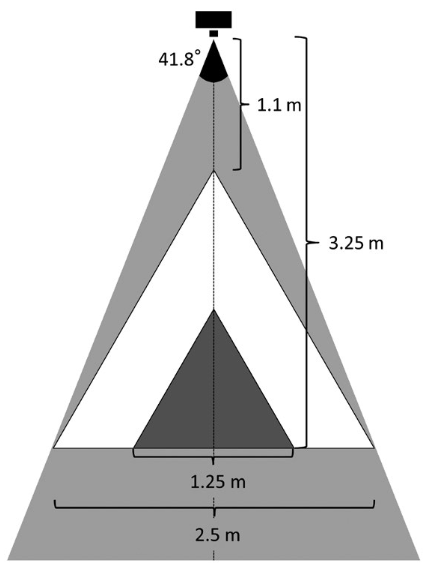

```{r, include = FALSE}
knitr::opts_chunk$set(
  collapse = TRUE,
  comment = "#>"
)
```

```{=html}
<style>
.caption {
  text-align: center;
  color: #717171;
  font-style: italic;
}
</style>
```


```{r echo=FALSE, fig.align='center', out.width='100%', fig.cap='© Habib Agossou'}

```


## Introduction  

Data analysis is not simply mastering software, running commands, or following a workflow. Weak foundations do not only lower data quality. They severely compromise every analysis built on them. In ecology, and particularly in wildlife monitoring, camera traps are used extensively. From these devices we can derive a wide range of analyses. These include, but are not limited to, relative abundance, species richness, alpha and beta diversity, occupancy, distribution modelling, and density estimation.

Each of these analyses carries minimum requirements. Above all, it carries assumptions that we must understand and respect before we collect any data. Forcing data to fit those requirements afterwards is a deliberate choice to betray reality and to corrupt the decisions that follow. We must therefore know in advance which data we need. We must also collect that data in the proper way.

In this post I revisit the key assumptions we must satisfy to estimate species density from camera traps. For each method, I specify the data it requires, how to collect that data in the field, and **available functions in *ct* R package to achieve the estimations**. There are many density estimation methods. I cannot cover them all, so I focus on a few of the most widely used. This does not make the other methods less important. For a broader treatment of the available methods, I recommend the review by Clarke et al. (2023). This article builds on that work and adds practice oriented detail.

## 1. Assumptions are a field decision, not a software setting

A density estimator is a model. A model rests on assumptions. When an assumption is violated, the estimate is biased, and no package can repair it after the survey ends. This is the central message of this article. The moment to satisfy an assumption is the moment you choose where to place a camera, how to set it, and what to record. It is not the moment you load your data into R.

Two examples make this concrete. The Random Encounter Model assumes that cameras are placed without regard to animal movement. If you place cameras on trails to gather more pictures, you break that assumption, and you cannot undo it later. Camera Trap Distance Sampling assumes that you can assign a reliable distance to each detected animal. If you do not record the information needed to recover that distance, the method is simply not feasible, whatever software you own.

So the first step of any density study is not data collection. It is choosing the method, reading its assumptions, and designing the collection around them.

## 2. The data every density study needs

Before we look at each method, here is the baseline that all of them share. Collect it for every study, without exception.

- **Station metadata.** A unique station identifier, the coordinates, the deployment start and end times, the camera model, and the camera height and angle.
- **Effort.** The exact period each camera was active. Effort is usually expressed in camera days or camera hours. Gaps caused by full memory cards, dead batteries, or theft must be recorded, because they reduce effort.
- **Accurate timestamps.** Set every camera clock correctly before deployment. For methods that compare cameras at the same instant, synchronise the clocks across all units.
- **Species identity and count.** Record the species and the number of individuals in each detection, not only its presence.
- **A clear placement scheme.** State whether cameras were placed at random, on a systematic grid, or at targeted features such as trails or water. The scheme determines which methods are valid.

If this baseline is missing or inconsistent, most density methods become impossible. The sections below add the specific data that each method needs on top of this baseline.

## 3. Method by method

A practical technique appears in several methods below, so I describe it once here. I call it the reference frame. Before or after a deployment, place visible markers at known distances and angles in front of the camera.

```{r echo=FALSE, fig.align='center', out.width='50%', fig.cap='Placement of visible markers at known distances and angles in front of a camera. Source: <https://youtu.be/UUlum77d5Cg>'}

```


Poles, stakes, flags, or a person holding a measuring rod all work. Photograph or film these markers. The resulting reference image lets you read, later, where an animal stood in the scene, and how far it was from the camera. The same reference image lets you delineate a detection zone, a viewshed, or a focal area. Keep this idea in mind. It is the field backbone of distance based and area based methods.

### 3.1 Camera Trap Distance Sampling (CTDS)

CTDS treats the camera as a point from which distances to animals are measured at fixed sampling instants, called snapshots (Howe et al., 2017). Density follows from how detection probability declines with distance (here distance between camera and animal).

**Data to collect**

- Snapshots *`t`* taken at a fixed time interval, for example every one or two seconds, so that animals are sampled as instantaneous points in time (e.g between 0.25 and 3 seconds for rare or highly mobile species, following Howe et al., 2017). Video is ideal, because it can be split into regular snapshots.
- The radial distance *`d`* from the camera to each detected animal at each snapshot, usually to the point where the animal contacts the ground.
- The camera field of view ***𝜃***, expressed as an angle. With it you know the fraction of a full circle that the camera surveys.
- The effort *`e`*, that is the number of active snapshot intervals, and
- The proportion *`p`* of the day the species is active, for the availability correction.

**How to collect the distance**

The distance is the quantity that makes or breaks this method. There are three practical routes.

1.  **Reference image and field measurement.** Identify, in the snapshot, where the animal stood. Return to the station and measure the real distance to that spot with a tape or a laser rangefinder. Stable landmarks in the scene help you find the spot again.
2.  **Stake or pole method.** Before deployment, place stakes at known distances and angles inside the field of view and photograph them. Each animal is then assigned to the distance interval in which it appears. This is fast, because reading an interval is quicker than measuring each animal.
3.  **Automated estimation.** Computer vision can estimate animal distance directly from video. Open pipelines exist for this task, for example the DistanceEstimationTracking project (<https://github.com/PJ-cs/DistanceEstimationTracking>) and the associated work on automated processing of camera trap video for distance sampling. Automation is useful for large video archives, but it still needs a calibrated reference frame.

**Practical notes.** Record distances in intervals rather than as exact values, and truncate the most distant observations, where detection is unreliable. Aim for a large number of detections, because distance sampling needs many observations to fit a detection function well.

### 3.2 Random Encounter Model (REM)

REM estimates density from the rate at which animals are photographed, corrected by how the animals move and how often the camera can detect them (Rowcliffe et al., 2008). It does not need individual recognition.

**Data to collect**

- The trap rate, that is the number of independent detections *`y`* divided by camera-days *`t`* (*trap rate = y/t*). Count independent encounters, not every photo of the same passing.
- The detection zone of the camera, described by an effective detection radius *`r`* and an effective detection angle ***𝜃***. Both are estimated from your own data, the same way distances are used in CTDS. The effective detection radius is the radius of camera field of view that would detect the same number of animals if detection were perfect inside it and zero outside. The effective detection angle is estimated from the angles at which animals are detected, measured relative to the camera's central axis.
- The day range *`dr`* of the species, that is the average distance an individual travels per day, or equivalently its movement speed *`v`* and activity.
- The activity level, that is the proportion *`p`* of the day the species is active (as in CTDS).

**How to collect the data**

- **Detection zone.** Calibrate it in the field. Walk an object of animal size through the field of view at known distances and angles, and record where the camera triggers. This gives the effective radius and angle. You can also estimate the zone from the distribution of measured detection distances and angles, using the same reference frame as in CTDS.

  
```{r echo=FALSE, fig.align='center', out.width='30%', fig.cap='Detection zone identification', fig.alt='Detection zone'}

```


- **Day range or speed.** The cleanest source is telemetry, if collared animals exist for the species. When telemetry is absent, you can estimate speed from the camera data itself, using the change in animal position between successive frames of a sequence , or more easly with camera video (*`v` = distance/duration*). Published values for the species are a last resort.

- **Activity.** Estimate it from the times of the independent detections.

- **Placement.** Place cameras without reference to signs of animal movement. Do not set them on trails, and do not use bait or lures. Targeted placement inflates the trap rate and inflates the density estimate.

### 3.3 Instantaneous Sampling Estimator (ISE)

ISE comes from the family of three estimators introduced by Moeller et al. (2018). It treats each camera as a plot and counts animals present at fixed instants, much like a series of point counts.

**Data to collect**

- The area of the camera viewshed (field of view), that is the ground area the camera actually surveys.
- Snapshots at regular sampling instants.
- The number of individuals present in the viewshed at each instant.
- The total study area that the cameras represent.

**How to collect the data**

- **Viewshed area.** Measure it with the reference frame. Place markers at the edges of the area where animals are reliably visible, photograph them, and compute the area on the ground.
- **Counts at instants.** Split video or burst sequences into regular snapshots, and count the animals inside the viewshed in each one.
- **Time.** Keep timestamps precise, because the instants are the unit of sampling.

### 3.4 Time To Event (TTE)

TTE, also from Moeller et al. (2018), measures the time that passes until the first animal appears in the viewshed during a sampling period. A short time to first appearance implies high density.

**Data to collect**

- Precise, continuous timestamps of detections within each sampling period.
- The viewshed transit time, that is the average time an animal needs to cross the viewshed. This depends on the viewshed size and the animal speed.
- The viewshed area, as for ISE.

**How to collect the data**

- **Time to event.** Set cameras to capture detections with accurate times, then read the time from the start of each sampling period to the first detection.
- **Transit time.** Combine the measured viewshed size with an estimate of animal speed. Speed can come from telemetry, from the camera sequences, or from the literature, exactly as in REM.

### 3.5 Space To Event (STE)

STE, the third estimator of Moeller et al. (2018), reverses the logic of TTE. At a chosen instant, it measures how much space must be searched across the camera network before an animal is found.

**Data to collect**

- The viewshed area of each camera.
- Snapshots at common sampling instants across the network.
- The number of animals present at each instant.
- Synchronised time across all cameras, so that the same instant means the same moment everywhere.

**How to collect the data**

- **Synchronised network.** This is the key field requirement. Set and check every clock so that the cameras can be read together at the same instant.
- **Viewshed and counts.** Measure each viewshed with the reference frame, and count animals at the shared instants, as for ISE.

### 3.6 Random Encounter and Staying Time (REST and RAD-REST)

REST estimates density from how often animals pass through a small focal area, how long they stay in it, and how active they are (Nakashima et al., 2018). The RAD-REST extension also models the number of passes per video, to handle miscounting.

**Data to collect**

- A focal area of known size, placed in front of the camera.

```{r echo=FALSE, fig.align='center', out.width='25%', fig.cap='The view-angle and total area in which camera traps can successfully detect passing animals and capture video images of them (grey triangle). Only video data capturing animals that passed within the larger (white; 2.67 m2) or smaller focal area (black; 0.67 m 2) were used for density estimations. Source: Nakashima et al. (2018).', fig.alt='view-angle'}

```

- The staying time, that is how long each animal remains inside the focal area.
- The number of passes through the focal area at each station.
- The effort and the activity level.
- For RAD-REST, the count of videos showing zero, one, two, and more passes.

**How to collect the data**

- **Record video.** Staying time cannot be read reliably from single photos. Set cameras to film, so that you can time when an animal enters and leaves the focal area.
- **Define and measure the focal area.** Mark a small zone in front of the camera, of known dimensions, and capture it in a reference frame. The focal area must be fully visible and clearly delimited.
- **Staying time and censoring.** From each video, record the entry and exit times. When an animal is still inside the focal area at the end of the clip, record the value as censored, because the true staying time is longer than observed.
- **Passes and activity.** Count the passes per video, and estimate activity from the detection times.

## 4. Assumptions at a glance

The table below summarises the core assumptions, the data each method needs beyond the shared baseline, and what goes wrong if the assumption is ignored. Read it before you design a survey, not after.

| Method | Core assumptions | Key data to collect | If ignored |
|------------------|------------------|------------------|------------------|
| CTDS | Animals sampled as snapshots; distance can be assigned; detection certain near the camera; representative placement | Snapshot interval, animal distance, field of view, availability | Biased detection function and biased density |
| REM | Random placement relative to movement; known detection zone; known speed and activity | Trap rate, detection radius and angle, day range or speed, activity | Inflated or deflated trap rate and density |
| ISE | Known viewshed area; representative placement; precise instants | Viewshed area, counts at instants, study area | Wrong density scaling |
| TTE | Known viewshed; known transit time; precise time | Time to first detection, transit time, viewshed area | Biased time to event and density |
| STE | Synchronised cameras; known viewsheds; representative placement | Synchronised instants, viewshed areas, counts | Mismatched space sampling and biased density |
| REST and RAD-REST | Known focal area; staying time observable; representative placement | Video, focal area size, staying time with censoring, passes, activity | Biased staying time and density |

A short rule connects every row. If you cannot collect the data in the key column, the method is not feasible. Choose another method, or change your field protocol.

## 5. How the ct package assists

The `ct` package brings these methods together under one consistent, tidy interface. It supports CTDS through `ct_fit_ds()`, with availability correction and automated model selection. It supports REM through `ct_fit_rem()`, with helpers for the detection zone, the movement speed, and the activity level. It supports the three Moeller estimators through `ct_fit_tte()`, `ct_fit_ste()`, and `ct_fit_ise()`. It supports REST and RAD-REST through `ct_fit_rest()`, with `ct_rest_stay()`, `ct_rest_passes()`, `ct_rest_effort()`, and `ct_rest_activity()` to prepare the staying time, the passes, the effort, and the activity.

The package also covers the steps before the model. Use `ct_independence()` to keep independent detections for a trap rate. Use `ct_camtrap_animal_distance()` to recover an animal distance from the field of view geometry of a reference image. Use `ct_to_radian()` and `ct_fit_activity()` for activity, and `ct_get_effort()` and `ct_traprate_data()` for effort and trap rate. Because every step shares the same data structure, you can prepare your detections once and then compare several estimators with little extra code. The full function reference is available [**here**](https://stangandaho.github.io/ct/reference/index.html).

## 6. Closing

Density estimation rewards planning and punishes improvisation. The method you choose dictates the data you must collect, and the field is where that data is won or lost. Read the assumptions first. Pick the method that your site and your resources can actually satisfy. Then collect exactly what that method needs, in the way it needs. If you do this, the analysis becomes a short and honest step at the end of a sound process. If you do not, no amount of software will save the result.

## References

Clarke, J., Bohm, H., Burton, C., & Constantinou, A. (2023). Using Camera Traps to Estimate Medium and Large Mammal Density: Comparison of Methods and Recommendations for Wildlife Managers Effective ecological monitoring View project Population and landscape genetics of small mammals View project.

Howe, E. J., Buckland, S. T., Després-Einspenner, M.-L., & Kühl, H. S. (2017). Distance sampling with camera traps. *Methods in Ecology and Evolution*, 8(11), 1558–1565.

Moeller, A. K., Lukacs, P. M., & Horne, J. S. (2018). Three novel methods to estimate abundance of unmarked animals using remote cameras. *Ecosphere*, 9(8), e02331.

Nakashima, Y., Fukasawa, K., & Samejima, H. (2018). Estimating animal density without individual recognition using information derivable exclusively from camera traps. *Journal of Applied Ecology*, 55(2), 735–744.

Rowcliffe, J. M., Field, J., Turvey, S. T., & Carbone, C. (2008). Estimating animal density using camera traps without the need for individual recognition. *Journal of Applied Ecology*, 45(4), 1228–1236.
